# 📘 Algoritmo de Detección de Batches - Documentación Técnica

## 🎯 Objetivo
Detectar batches (lotes de producción) en datos continuos del caudalímetro Coriolis, utilizando **perfil dinámico** (volumen mínimo y tiempo de cierre) capturado del primer dato de cada batch.

---

## 📊 Flujo General del Algoritmo

```mermaid
graph TD
    A[🚀 Inicio: Recibir rango de fechas] --> B[📥 Consultar datos NodeRedData con margen +2h]
    B --> C[🔄 Iterar dato por dato ordenado por timestamp]
    C --> D{¿mass_rate > 0?}
    
    D -->|SÍ| E{¿Hay batch activo?}
    D -->|NO| F{¿Hay batch activo?}
    
    E -->|NO| G[🆕 Iniciar nuevo batch]
    E -->|SÍ| H[➕ Agregar dato al batch]
    
    G --> I[📋 Capturar perfil del 1er dato:<br/>vol_detect_batch<br/>time_closed_batch]
    I --> J[💾 Guardar primer_dato como referencia]
    
    H --> K{¿Cambio de día?}
    K -->|SÍ| L[🌙 Cerrar batch del día anterior<br/>en 23:59:59.999999]
    K -->|NO| M[✅ Continuar batch normalmente]
    
    F -->|SÍ| N[⏱️ Iniciar/continuar contador tiempo_cero]
    F -->|NO| O[💤 Esperar próximo dato con flujo]
    
    N --> P{¿tiempo_cero >= time_closed_batch?}
    P -->|SÍ| Q[🔴 Cerrar batch]
    P -->|NO| R[⏳ Seguir esperando]
    
    Q --> S{¿masa_total >= vol_minimo?}
    S -->|SÍ| T[✅ Guardar batch válido]
    S -->|NO| U[❌ Descartar batch]
    
    L --> S
    M --> C
    R --> C
    O --> C
    T --> V[🔄 Reiniciar estado para nuevo batch]
    U --> V
    V --> C
    
    C --> W{¿Fin de datos?}
    W -->|NO| C
    W -->|SÍ| X{¿Batch abierto?}
    
    X -->|SÍ| Y{¿Flujo=0 O cambio_día?}
    X -->|NO| Z[🏁 Retornar batches detectados]
    
    Y -->|SÍ| S
    Y -->|NO| AA[⚠️ Batch sin cerrar - ignorar]
    AA --> Z
```



---

## 🔍 Descripción Paso a Paso

### **Fase 1: Preparación** (Método `post`)

#### 1. **Recibir Parámetros**
```python
POST /api/sistemas/{sistema_id}/detectar-batches/
{
    "fecha_inicio": "2026-01-08 00:00:00",  # Formato: YYYY-MM-DD HH:MM:SS
    "fecha_fin": "2026-01-08 23:59:59"
}
```

#### 2. **Obtener Configuración del Sistema**
```python
ConfiguracionCoeficientes:
    lim_inf_caudal_masico: 10 kg/min   # Límite inferior (SOLO REFERENCIA)
    lim_sup_caudal_masico: 200 kg/min  # Límite superior (SOLO REFERENCIA)
```
**Nota**: Estos límites NO se usan en la detección, solo para referencia histórica.

#### 3. **Consultar Datos con Margen Temporal**
```python
# Rango de consulta ampliado
fecha_inicio_consulta = fecha_inicio (UTC)
fecha_fin_consulta = fecha_fin + 2 horas (UTC)
```

**¿Por qué el margen de +2 horas?**
- Detectar batches que cruzan medianoche
- Ejemplo: Batch inicia 23:50 del día consultado, termina 00:10 del día siguiente
- Sin margen, no detectaríamos el cierre del batch

#### 4. **Conversión de Zona Horaria**
```python
# Frontend envía fechas en hora de Colombia
fecha_inicio_colombia = COLOMBIA_TZ.localize(fecha_inicio_naive)

# Convertir a UTC para consultas de BD
fecha_inicio_utc = fecha_inicio_colombia.astimezone(pytz.UTC)
```

---

### **Fase 2: Detección de Batches** (Método `_detectar_batches_con_perfil_dinamico`)

#### **Variables de Estado Iniciales**
```python
batches = []                      # Lista de batches detectados
en_batch = False                  # ¿Hay un batch activo?
inicio_batch = None               # Timestamp de inicio del batch actual
primer_dato = None                # Primer punto del batch (referencia para cálculos)
datos_batch = []                  # Todos los datos del batch actual
punto_anterior = None             # Último dato con mass_rate = 0
tiempo_cero_inicio = None         # Timestamp cuando cayó a cero
ultimo_dato_con_flujo = None      # Último dato con mass_rate > 0
vol_minimo_batch = None           # Capturado del 1er dato (kg)
time_finished_batch_actual = None # Capturado del 1er dato (minutos)
```

---

#### 🔄 **Loop Principal: Recorrer cada dato**

```python
for dato in datos.order_by('created_at_iot'):
    mass_rate_kg_min = lb_s_a_kg_min(dato.mass_rate)  # Convertir lb/s → kg/min
    
    # Validar datos necesarios
    if mass_rate_raw is None or total_mass is None or total_volume is None:
        continue  # Saltar dato incompleto
```

---

### **📈 CASO A: Flujo Activo (`mass_rate > 0`)**

#### **A1. No hay batch activo → INICIAR NUEVO BATCH**

```python
if mass_rate_kg_min > 0 and not en_batch:
    # ✅ Validar que el dato está dentro del rango solicitado
    if timestamp_actual < fecha_inicio_rango or timestamp_actual > fecha_fin_rango:
        punto_anterior = dato
        continue  # Ignorar dato fuera de rango
    
    # 📋 CAPTURAR PERFIL DEL PRIMER DATO (clave del algoritmo)
    vol_detect = dato.vol_detect_batch      # Volumen mínimo para batch válido (kg)
    time_closed = dato.time_closed_batch    # Tiempo de espera sin flujo (minutos)
    
    # Validar que el dato tiene perfil válido
    if vol_detect is None or time_closed is None:
        logger.warning(f"Dato sin perfil válido - IGNORANDO")
        continue
    
    # 🎯 Guardar perfil (se mantiene constante hasta que el batch se cierra)
    vol_minimo_batch = vol_detect
    time_finished_batch_actual = time_closed
    
    # 🆕 Iniciar nuevo batch
    en_batch = True
    inicio_batch = dato.created_at_iot
    tiempo_cero_inicio = None
    
    # Usar punto anterior (donde flujo = 0) como referencia para cálculos
    if punto_anterior is not None:
        primer_dato = punto_anterior  # Dato con mass_rate = 0
    else:
        primer_dato = dato  # No hay punto anterior, usar el actual
    
    datos_batch = [dato]
    ultimo_dato_con_flujo = dato
```

**Concepto clave: ¿Por qué usar `punto_anterior`?**
- El `punto_anterior` es el último dato con `mass_rate = 0` antes de iniciar el batch
- Usarlo como referencia permite calcular la masa/volumen total desde que el flujo estaba en cero
- Si no existe `punto_anterior`, usamos el dato actual como inicio

---

#### **A2. Hay batch activo → VERIFICAR CAMBIO DE DÍA**

```python
if mass_rate_kg_min > 0 and en_batch:
    # 🌙 VERIFICAR CAMBIO DE DÍA (importante para reportes diarios)
    fecha_inicio_batch_colombia = primer_dato.created_at_iot.astimezone(COLOMBIA_TZ).date()
    fecha_dato_actual_colombia = dato.created_at_iot.astimezone(COLOMBIA_TZ).date()
    
    if fecha_inicio_batch_colombia != fecha_dato_actual_colombia:
        # ⚠️ HAY CAMBIO DE DÍA - Cerrar batch del día anterior
        logger.warning(f"🌙 Cambio de día detectado: {fecha_inicio_batch_colombia} -> {fecha_dato_actual_colombia}")
```

##### **🌙 Lógica de Cambio de Día (Medianoche)**

**Problema**: Un batch que inicia a las 23:50 y termina a las 00:10 cruza dos días.

**Solución**: 
1. Cerrar el batch del día anterior en `23:59:59.999999`
2. Si el dato actual está en el rango consultado, iniciar un nuevo batch para el día siguiente

```python
# Encontrar el último dato del día anterior (antes de medianoche)
ultimo_dato_dia_anterior = None
for d in reversed(datos_batch):
    if d.created_at_iot.astimezone(COLOMBIA_TZ).date() == fecha_inicio_batch_colombia:
        ultimo_dato_dia_anterior = d
        break

if ultimo_dato_dia_anterior is not None:
    # Calcular masa y volumen hasta el último dato del día anterior
    masa_inicial_lb = primer_dato.total_mass
    masa_final_lb = ultimo_dato_dia_anterior.total_mass
    diferencia_masa_lb = masa_final_lb - masa_inicial_lb
    diferencia_masa_kg = lb_a_kg(diferencia_masa_lb)
    
    volumen_inicial_cm3 = primer_dato.total_volume
    volumen_final_cm3 = ultimo_dato_dia_anterior.total_volume
    diferencia_volumen_cm3 = volumen_final_cm3 - volumen_inicial_cm3
    diferencia_volumen_gal = cm3_a_gal(diferencia_volumen_cm3)
    
    # IMPORTANTE: Usar 23:59:59.999999 del día anterior como fecha_fin
    fecha_fin_dia_anterior = COLOMBIA_TZ.localize(
        datetime.combine(fecha_inicio_batch_colombia, time(23, 59, 59, 999999))
    ).astimezone(pytz.UTC)
    
    # Validar si cumple el volumen mínimo
    if diferencia_masa_kg >= vol_minimo_batch:
        # Calcular promedios de temperatura, densidad, presión
        temperaturas = [d.coriolis_temperature for d in datos_dia_anterior if d.coriolis_temperature is not None]
        densidades = [d.density for d in datos_dia_anterior if d.density is not None]
        presiones = [d.pressure_out for d in datos_dia_anterior if d.pressure_out is not None]
        
        temp_prom = sum(temperaturas) / len(temperaturas) if temperaturas else 0
        dens_prom = sum(densidades) / len(densidades) if densidades else 0
        pres_prom = sum(presiones) / len(presiones) if presiones else None
        
        batches.append({
            'fecha_inicio': primer_dato.created_at_iot,
            'fecha_fin': fecha_fin_dia_anterior,  # 23:59:59.999999
            'vol_total': diferencia_volumen_gal,
            'mass_total': diferencia_masa_kg,
            'temperatura_coriolis_prom': temp_prom,
            'densidad_prom': dens_prom,
            'pressure_out_prom': pres_prom,
            'duracion_minutos': (fecha_fin_dia_anterior - primer_dato.created_at_iot).total_seconds() / 60,
            'total_registros': len(datos_dia_anterior),
            'vol_minimo_usado': vol_minimo_batch,
            'time_finished_usado': time_finished_batch_actual
        })
        logger.info(f"✅ Batch día anterior guardado: Masa={diferencia_masa_kg:.2f}kg")
    else:
        logger.info(f"❌ Batch día anterior descartado: {diferencia_masa_kg:.2f}kg < {vol_minimo_batch:.2f}kg")
```

##### **🔄 Iniciar Nuevo Batch del Día Siguiente**

```python
# Verificar si el dato actual está dentro del rango solicitado
if timestamp_actual >= fecha_inicio_rango and timestamp_actual <= fecha_fin_rango:
    logger.info(f"🔄 Iniciando nuevo batch del día siguiente: {fecha_dato_actual_colombia}")
    
    # Capturar perfil del dato actual (nuevo batch, nuevo perfil)
    vol_detect_nuevo = dato.vol_detect_batch
    time_closed_nuevo = dato.time_closed_batch
    
    if vol_detect_nuevo is not None and time_closed_nuevo is not None:
        # Iniciar nuevo batch con el dato actual
        en_batch = True
        inicio_batch = dato.created_at_iot
        primer_dato = dato
        datos_batch = [dato]
        ultimo_dato_con_flujo = dato
        tiempo_cero_inicio = None
        vol_minimo_batch = vol_detect_nuevo
        time_finished_batch_actual = time_closed_nuevo
    else:
        # Si no tiene perfil válido, reiniciar estado y esperar
        en_batch = False
        primer_dato = None
        datos_batch = []
        tiempo_cero_inicio = None
        ultimo_dato_con_flujo = None
        vol_minimo_batch = None
        time_finished_batch_actual = None
else:
    # El dato actual está fuera del rango, reiniciar estado
    en_batch = False
    inicio_batch = None
    primer_dato = None
    datos_batch = []
    tiempo_cero_inicio = None
    ultimo_dato_con_flujo = None
    vol_minimo_batch = None
    time_finished_batch_actual = None
```

---

#### **A3. Mismo día → CONTINUAR BATCH NORMALMENTE**

```python
else:  # No hay cambio de día
    datos_batch.append(dato)
    ultimo_dato_con_flujo = dato
    
    # Si había un contador de tiempo en cero, reiniciarlo
    if tiempo_cero_inicio is not None:
        tiempo_antes_subir = timestamp_actual - tiempo_cero_inicio
        minutos_antes_subir = tiempo_antes_subir.total_seconds() / 60
        logger.info(f"🔄 Flujo volvió a subir después de {minutos_antes_subir:.2f} min - Continuando batch")
        tiempo_cero_inicio = None  # Reiniciar contador
```

**Concepto**: Si el flujo estaba en cero y vuelve a subir, el batch continúa (no se cierra).

---

### **📉 CASO B: Sin Flujo (`mass_rate <= 0`)**

```python
if mass_rate_kg_min <= 0:
    if en_batch:
        # Hay un batch activo, verificar tiempo de espera
        
        if tiempo_cero_inicio is None:
            # 🔴 Primera vez que el flujo cae a cero
            tiempo_cero_inicio = timestamp_actual
            logger.info(f"🔴 Flujo cayó a cero - Esperando {time_finished_batch_actual:.2f} min para cerrar batch")
        else:
            # ⏱️ Verificar si ya pasó el tiempo de espera
            tiempo_transcurrido = timestamp_actual - tiempo_cero_inicio
            minutos_en_cero = tiempo_transcurrido.total_seconds() / 60
            
            if minutos_en_cero >= time_finished_batch_actual:
                # ✅ Tiempo cumplido - CERRAR BATCH
                fin_batch = tiempo_cero_inicio  # Usar el momento cuando empezó a estar en cero
                logger.info(f"✅ Cerrando batch - {minutos_en_cero:.2f} min en cero (límite: {time_finished_batch_actual:.2f} min)")
```

#### **🔴 Cerrar Batch por Tiempo de Espera**

```python
# Calcular diferencias de masa y volumen entre último dato con flujo y primer punto
if primer_dato and ultimo_dato_con_flujo:
    # Cálculos de masa
    masa_inicial_lb = primer_dato.total_mass
    masa_final_lb = ultimo_dato_con_flujo.total_mass
    diferencia_masa_lb = masa_final_lb - masa_inicial_lb
    diferencia_masa_kg = lb_a_kg(diferencia_masa_lb)
    
    # Cálculos de volumen (convertir de cm³ a galones)
    volumen_inicial_cm3 = primer_dato.total_volume
    volumen_final_cm3 = ultimo_dato_con_flujo.total_volume
    diferencia_volumen_cm3 = volumen_final_cm3 - volumen_inicial_cm3
    diferencia_volumen_gal = cm3_a_gal(diferencia_volumen_cm3)
    
    # Solo guardar si la diferencia de masa supera el volumen mínimo
    if diferencia_masa_kg >= vol_minimo_batch:
        # Calcular promedios
        temperaturas = [d.coriolis_temperature for d in datos_batch if d.coriolis_temperature is not None]
        densidades = [d.density for d in datos_batch if d.density is not None]
        presiones = [d.pressure_out for d in datos_batch if d.pressure_out is not None]
        
        temp_prom = sum(temperaturas) / len(temperaturas) if temperaturas else 0
        dens_prom = sum(densidades) / len(densidades) if densidades else 0
        pres_prom = sum(presiones) / len(presiones) if presiones else None
        
        batches.append({
            'fecha_inicio': primer_dato.created_at_iot,
            'fecha_fin': fin_batch,
            'vol_total': diferencia_volumen_gal,
            'mass_total': diferencia_masa_kg,
            'temperatura_coriolis_prom': temp_prom,
            'densidad_prom': dens_prom,
            'pressure_out_prom': pres_prom,
            'duracion_minutos': (fin_batch - primer_dato.created_at_iot).total_seconds() / 60,
            'total_registros': len(datos_batch),
            'vol_minimo_usado': vol_minimo_batch,
            'time_finished_usado': time_finished_batch_actual
        })
        logger.info(f"✅ Batch guardado: Vol={diferencia_volumen_gal:.2f}gal, Masa={diferencia_masa_kg:.2f}kg")

# 🔄 Reiniciar estado para el siguiente batch
en_batch = False
inicio_batch = None
primer_dato = None
datos_batch = []
tiempo_cero_inicio = None
ultimo_dato_con_flujo = None
vol_minimo_batch = None
time_finished_batch_actual = None
```

---

#### **💤 No hay batch activo**

```python
else:
    # No hay batch activo, guardar como punto anterior
    tiempo_cero_inicio = None

# Guardar este punto como posible referencia para el próximo batch
punto_anterior = dato
```

**Concepto**: Los datos con `mass_rate = 0` se guardan como `punto_anterior` para usarlos como referencia cuando inicie un nuevo batch.

---

### **Fase 3: Batch Final Abierto**

Al terminar el loop principal, puede quedar un batch abierto que necesita cerrarse:

```python
# Si termina con un batch abierto al final del rango de fechas
if en_batch and datos_batch and primer_dato is not None and ultimo_dato_con_flujo is not None:
    # Verificar si el último dato procesado tiene flujo activo
    ultimo_dato = datos_batch[-1] if datos_batch else None
    ultimo_mass_rate_kg_min = lb_s_a_kg_min(ultimo_dato.mass_rate) if ultimo_dato and ultimo_dato.mass_rate is not None else 0
    
    # Verificar si hay cambio de día entre el inicio del batch y el último dato
    fecha_inicio_batch_colombia = primer_dato.created_at_iot.astimezone(COLOMBIA_TZ).date()
    fecha_ultimo_dato_colombia = ultimo_dato.created_at_iot.astimezone(COLOMBIA_TZ).date() if ultimo_dato else fecha_inicio_batch_colombia
    cambio_de_dia = fecha_inicio_batch_colombia != fecha_ultimo_dato_colombia
    
    # Solo cerrar el batch si:
    # 1. El flujo está en cero (mass_rate <= 0), O
    # 2. Hay cambio de día (medianoche) para reportar lo del día anterior
    if ultimo_mass_rate_kg_min <= 0 or cambio_de_dia:
        # Cálculos de masa
        masa_inicial_lb = primer_dato.total_mass
        masa_final_lb = ultimo_dato_con_flujo.total_mass
        diferencia_masa_lb = masa_final_lb - masa_inicial_lb
        diferencia_masa_kg = lb_a_kg(diferencia_masa_lb)
        
        # Cálculos de volumen
        volumen_inicial_cm3 = primer_dato.total_volume
        volumen_final_cm3 = ultimo_dato_con_flujo.total_volume
        diferencia_volumen_cm3 = volumen_final_cm3 - volumen_inicial_cm3
        diferencia_volumen_gal = cm3_a_gal(diferencia_volumen_cm3)
        
        razon_cierre = "cambio de día (medianoche)" if cambio_de_dia else "flujo en cero al final del rango"
        
        if diferencia_masa_kg >= vol_minimo_batch:
            temperaturas = [d.coriolis_temperature for d in datos_batch if d.coriolis_temperature is not None]
            densidades = [d.density for d in datos_batch if d.density is not None]
            presiones = [d.pressure_out for d in datos_batch if d.pressure_out is not None]
            
            temp_prom = sum(temperaturas) / len(temperaturas) if temperaturas else 0
            dens_prom = sum(densidades) / len(densidades) if densidades else 0
            pres_prom = sum(presiones) / len(presiones) if presiones else None
            
            batches.append({
                'fecha_inicio': primer_dato.created_at_iot,
                'fecha_fin': ultimo_dato_con_flujo.created_at_iot,
                'vol_total': diferencia_volumen_gal,
                'mass_total': diferencia_masa_kg,
                'temperatura_coriolis_prom': temp_prom,
                'densidad_prom': dens_prom,
                'pressure_out_prom': pres_prom,
                'duracion_minutos': (ultimo_dato_con_flujo.created_at_iot - primer_dato.created_at_iot).total_seconds() / 60,
                'total_registros': len(datos_batch),
                'vol_minimo_usado': vol_minimo_batch,
                'time_finished_usado': time_finished_batch_actual
            })
            logger.info(f"✅ Batch final guardado: Vol={diferencia_volumen_gal:.2f}gal, Masa={diferencia_masa_kg:.2f}kg")
        else:
            logger.info(f"❌ Batch final descartado: {diferencia_masa_kg:.2f}kg < {vol_minimo_batch:.2f}kg")
    else:
        # Batch NO cerrado: flujo activo y sin cambio de día
        pass

logger.info(f"✅ Detección completada: {len(batches)} batches detectados")
return batches
```

**Criterios de cierre del batch final:**
- ✅ **Cerrar** si `mass_rate <= 0` al final del rango
- ✅ **Cerrar** si hay cambio de día (cruce de medianoche)
- ❌ **NO cerrar** si el flujo sigue activo y NO hay cambio de día (batch aún en proceso)

---

### **Fase 4: Filtrado y Guardado**

#### **4.1. Filtrar Batches por Rango**

```python
# Solo mantener batches que INICIAN dentro del rango solicitado
batches_en_rango = []
batches_fuera_rango = 0

for batch_data in batches_detectados:
    fecha_inicio_batch = batch_data['fecha_inicio']
    if fecha_inicio <= fecha_inicio_batch <= fecha_fin:
        batches_en_rango.append(batch_data)
    else:
        batches_fuera_rango += 1

if batches_fuera_rango > 0:
    logger.info(f"Filtrados {batches_fuera_rango} batches fuera del rango solicitado")
```

**Importante**: Solo se guardan batches que **inician** en el rango consultado. Si un batch inicia antes del rango pero termina dentro, se descarta.

---

#### **4.2. Generar Hash Único (Prevención de Duplicados)**

```python
def _generar_hash_batch(self, fecha_inicio, fecha_fin, sistema_id, vol_minimo, time_finished_batch):
    # Crear string único con parámetros del batch
    fecha_inicio_str = fecha_inicio.strftime('%Y-%m-%d %H:%M:%S')
    fecha_fin_str = fecha_fin.strftime('%Y-%m-%d %H:%M:%S')
    
    datos_hash = f"{sistema_id}_{fecha_inicio_str}_{fecha_fin_str}_{vol_minimo}_{time_finished_batch}"
    
    # Generar hash SHA-256
    hash_obj = hashlib.sha256(datos_hash.encode('utf-8'))
    return hash_obj.hexdigest()
```

**Propósito del hash:**
- Identificar de forma única cada batch
- Prevenir duplicados si se ejecuta la detección múltiples veces
- El hash incluye parámetros que realmente afectan la detección

---

#### **4.3. Guardar en Base de Datos**

```python
batches_nuevos = 0
batches_existentes = 0
batches_completos = []

for batch_data in batches_en_rango:
    # Generar hash único
    hash_batch = self._generar_hash_batch(
        batch_data['fecha_inicio'],
        batch_data['fecha_fin'],
        sistema.id,
        batch_data['vol_minimo_usado'],
        batch_data['time_finished_usado']
    )
    
    # Verificar si el batch ya existe
    batch_existente = BatchDetectado.objects.filter(hash_identificacion=hash_batch).first()
    
    if batch_existente:
        # El batch ya existe, no crear duplicado
        batches_existentes += 1
        batch = batch_existente
    else:
        # El batch NO existe, crear uno nuevo
        try:
            batch = BatchDetectado.objects.create(
                systemId=sistema,
                fecha_inicio=batch_data['fecha_inicio'],
                fecha_fin=batch_data['fecha_fin'],
                vol_total=batch_data['vol_total'],
                mass_total=batch_data['mass_total'],
                temperatura_coriolis_prom=batch_data['temperatura_coriolis_prom'],
                densidad_prom=batch_data['densidad_prom'],
                pressure_out_prom=batch_data.get('pressure_out_prom'),
                hash_identificacion=hash_batch,
                perfil_lim_inf_caudal=lim_inf,
                perfil_lim_sup_caudal=lim_sup,
                perfil_vol_minimo=batch_data['vol_minimo_usado'],
                duracion_minutos=batch_data['duracion_minutos'],
                total_registros=batch_data['total_registros'],
                time_finished_batch=batch_data['time_finished_usado']
            )
            batches_nuevos += 1
        except IntegrityError:
            # Condición de carrera: otro proceso creó el batch justo ahora
            batch = BatchDetectado.objects.get(hash_identificacion=hash_batch)
            batches_existentes += 1
    
    # Agregar a lista de respuesta
    batches_completos.append({
        'id': batch.id,
        'fecha_inicio': batch.fecha_inicio.astimezone(COLOMBIA_TZ).isoformat(),
        'fecha_fin': batch.fecha_fin.astimezone(COLOMBIA_TZ).isoformat(),
        'vol_total': batch.vol_total,
        'mass_total': batch.mass_total,
        'temperatura_coriolis_prom': batch.temperatura_coriolis_prom,
        'densidad_prom': batch.densidad_prom,
        'pressure_out_prom': batch.pressure_out_prom,
        'duracion_minutos': batch.duracion_minutos,
        'perfil_vol_minimo': batch.perfil_vol_minimo,
        'time_finished_batch': batch.time_finished_batch,
    })

logger.info(f"✅ Proceso completado: {batches_nuevos} nuevos, {batches_existentes} existentes, {len(batches_completos)} total")
```

---

## 📐 Fórmulas de Cálculo

### **Conversión de Unidades**

#### **Caudal Másico: lb/s → kg/min**
```python
def lb_s_a_kg_min(lb_s):
    return lb_s * 0.453592 * 60

# Ejemplo:
# 2 lb/s = 2 * 0.453592 * 60 = 54.43 kg/min
```

#### **Masa: lb → kg**
```python
def lb_a_kg(lb):
    return lb * 0.453592

# Ejemplo:
# 220.5 lb = 220.5 * 0.453592 = 100 kg
```

#### **Volumen: cm³ → galones**
```python
def cm3_a_gal(cm3):
    return cm3 * 0.000264172

# Ejemplo:
# 5000 cm³ = 5000 * 0.000264172 = 1.32 galones
```

---

### **Diferencias de Masa/Volumen**

```python
# Masa total del batch
diferencia_masa_lb = ultimo_dato.total_mass - primer_dato.total_mass
diferencia_masa_kg = lb_a_kg(diferencia_masa_lb)

# Volumen total del batch
diferencia_volumen_cm3 = ultimo_dato.total_volume - primer_dato.total_volume
diferencia_volumen_gal = cm3_a_gal(diferencia_volumen_cm3)
```

**Concepto clave:**
- `primer_dato`: Punto de referencia al inicio del batch (cuando `mass_rate = 0`)
- `ultimo_dato_con_flujo`: Último dato con `mass_rate > 0` antes de cerrar
- La diferencia entre ambos da la masa/volumen total del batch

---

### **Promedios de Variables**

```python
# Temperatura promedio
temperaturas = [d.coriolis_temperature for d in datos_batch if d.coriolis_temperature is not None]
temp_prom = sum(temperaturas) / len(temperaturas) if temperaturas else 0

# Densidad promedio
densidades = [d.density for d in datos_batch if d.density is not None]
dens_prom = sum(densidades) / len(densidades) if densidades else 0

# Presión promedio (puede ser None)
presiones = [d.pressure_out for d in datos_batch if d.pressure_out is not None]
pres_prom = sum(presiones) / len(presiones) if presiones else None
```

---

### **Duración del Batch**

```python
duracion_minutos = (fecha_fin_batch - fecha_inicio_batch).total_seconds() / 60
```

---

## 🎨 Casos Especiales

### **1. Cambio de Día (Medianoche)**

**Problema:**
```
Batch inicia: 2026-01-08 23:50:00
Batch termina: 2026-01-09 00:10:00
```
El batch cruza dos días diferentes.

**Solución:**
1. Cerrar batch del 08/01 en `2026-01-08 23:59:59.999999`
2. Si el dato de 00:10 del 09/01 está en el rango consultado, iniciar nuevo batch

**Razón:**
- Los reportes diarios necesitan batches separados por día
- Cada día tiene su propio reporte de producción

---

### **2. Reset del Caudalímetro**

**Problema:**
```
Dato 1: total_mass = 1000 lb
Dato 2: total_mass = 1250 lb
Dato 3: total_mass = 50 lb   ← Reset detectado
Dato 4: total_mass = 200 lb
```

**Detección:**
```python
if diferencia_masa < 0 or diferencia_masa > 100000:
    # Reset detectado
    masa_acumulada += lb_a_kg(total_mass_actual)  # Empezar desde el valor actual
    resets_detectados += 1
```

**Solución:**
- No usar diferencias cuando hay reset
- Empezar a contar desde el valor actual después del reset
- Esto se aplica en `_calcular_masa_total_bruta()`

---

### **3. Batch que Cruza el Rango Consultado**

**Problema:**
```
Rango consultado: 2026-01-08 00:00 a 2026-01-08 23:59
Batch inicia: 2026-01-07 23:50
Batch termina: 2026-01-08 00:10
```

**Solución:**
1. Usar margen de +2 horas en la consulta: `2026-01-08 23:59 + 2h = 2026-01-09 01:59`
2. Detectar todos los batches en el rango ampliado
3. **Filtrar**: Solo mantener batches que **inician** en el rango original

```python
if fecha_inicio <= batch['fecha_inicio'] <= fecha_fin:
    batches_en_rango.append(batch)
else:
    batches_fuera_rango += 1  # Descartar
```

**Resultado:**
- El batch del ejemplo se descarta porque inicia el 07/01 (fuera del rango 08/01)

---

### **4. Múltiples Cambios de Flujo (Paradas y Arranques)**

**Problema:**
```
10:00 - mass_rate = 0
10:01 - mass_rate = 100    ← Inicia batch
10:05 - mass_rate = 0      ← Cae a cero, inicia contador
10:08 - mass_rate = 80     ← Vuelve a subir antes del tiempo límite
10:12 - mass_rate = 0      ← Cae a cero nuevamente
10:18 - mass_rate = 0      ← Pasa el tiempo límite, cierra batch
```

**Solución:**
- Si `mass_rate` vuelve a subir antes de `time_closed_batch`, el batch continúa
- El contador `tiempo_cero_inicio` se reinicia cuando el flujo sube
- Solo se cierra cuando el tiempo completo sin flujo se cumple

```python
# Cuando el flujo vuelve a subir
if tiempo_cero_inicio is not None:
    logger.info(f"🔄 Flujo volvió a subir - Continuando batch")
    tiempo_cero_inicio = None  # Reiniciar contador
```

---

### **5. Batch Muy Corto (Menor a `vol_minimo_batch`)**

**Problema:**
```
Batch detectado:
- Duración: 2 minutos
- Masa total: 20 kg
- vol_minimo_batch: 50 kg
```

**Solución:**
- El batch se detecta pero se descarta porque no cumple el volumen mínimo
- No se guarda en la base de datos

```python
if diferencia_masa_kg >= vol_minimo_batch:
    batches.append(batch)  # Guardar
else:
    # Descartar batch (muy corto/pequeño)
    pass
```

---

### **6. Datos Incompletos o Nulos**

**Problema:**
```
Dato con:
- mass_rate = None
- total_mass = 1000
- total_volume = 5000
```

**Solución:**
```python
if mass_rate_raw is None or total_mass is None or total_volume is None:
    continue  # Saltar dato incompleto
```

---

### **7. Dato sin Perfil Válido**

**Problema:**
```
Dato con:
- vol_detect_batch = None
- time_closed_batch = 5
```

**Solución:**
```python
if vol_detect is None or time_closed is None:
    logger.warning(f"Dato sin perfil válido - IGNORANDO")
    continue
```

No se puede iniciar un batch sin perfil completo.

---

## 📊 Variables de Estado

| Variable | Tipo | Inicial | Descripción |
|----------|------|---------|-------------|
| `en_batch` | bool | `False` | Indica si hay un batch activo |
| `inicio_batch` | datetime | `None` | Timestamp de inicio del batch actual |
| `primer_dato` | NodeRedData | `None` | Primer punto del batch (referencia para diferencias) |
| `ultimo_dato_con_flujo` | NodeRedData | `None` | Último dato con `mass_rate > 0` |
| `datos_batch` | list | `[]` | Todos los datos del batch actual |
| `tiempo_cero_inicio` | datetime | `None` | Timestamp cuando `mass_rate` cayó a 0 |
| `vol_minimo_batch` | float | `None` | Volumen mínimo capturado del 1er dato (kg) |
| `time_finished_batch_actual` | float | `None` | Tiempo de espera capturado del 1er dato (min) |
| `punto_anterior` | NodeRedData | `None` | Último dato con `mass_rate = 0` (antes de iniciar batch) |
| `batches` | list | `[]` | Lista de batches detectados |

---

## 🚨 Validaciones Críticas

### **Al Iniciar Batch**

```python
✅ dato.vol_detect_batch is not None
✅ dato.time_closed_batch is not None
✅ timestamp_actual >= fecha_inicio_rango
✅ timestamp_actual <= fecha_fin_rango
✅ mass_rate > 0
```

Si alguna validación falla, el batch NO se inicia.

---

### **Al Cerrar Batch**

```python
✅ diferencia_masa >= vol_minimo_batch
✅ primer_dato is not None
✅ ultimo_dato_con_flujo is not None
✅ minutos_en_cero >= time_finished_batch_actual (si cierre por tiempo)
```

Si `diferencia_masa < vol_minimo_batch`, el batch se descarta.

---

### **Prevención de Duplicados**

```python
✅ Hash único por batch (sistema + fechas + perfil)
✅ Verificar existencia: BatchDetectado.objects.filter(hash_identificacion=hash_batch).exists()
✅ Manejar IntegrityError (condiciones de carrera en BD)
```

---

## 📈 Ejemplo Completo Paso a Paso

### **Datos de Entrada**

```
Timestamp         | mass_rate (kg/min) | total_mass (lb) | total_volume (cm³) | vol_detect | time_closed
2026-01-08 10:00  | 0                  | 1000           | 5000              | 50         | 5
2026-01-08 10:01  | 100                | 1100           | 5100              | 50         | 5
2026-01-08 10:02  | 120                | 1250           | 5250              | 50         | 5
2026-01-08 10:03  | 110                | 1380           | 5380              | 50         | 5
2026-01-08 10:04  | 0                  | 1380           | 5380              | 50         | 5
2026-01-08 10:05  | 0                  | 1380           | 5380              | 50         | 5
2026-01-08 10:06  | 0                  | 1380           | 5380              | 50         | 5
2026-01-08 10:07  | 0                  | 1380           | 5380              | 50         | 5
2026-01-08 10:08  | 0                  | 1380           | 5380              | 50         | 5
2026-01-08 10:09  | 0                  | 1380           | 5380              | 50         | 5
```

---

### **Ejecución del Algoritmo**

#### **10:00 - mass_rate = 0**
```python
mass_rate_kg_min = 0
en_batch = False

# No hay batch activo, guardar como punto anterior
punto_anterior = dato(10:00)
```

---

#### **10:01 - mass_rate = 100** ✅ **INICIAR BATCH**
```python
mass_rate_kg_min = 100 > 0
en_batch = False

# Capturar perfil del primer dato
vol_minimo_batch = 50 kg
time_finished_batch_actual = 5 minutos

# Usar punto anterior como referencia
primer_dato = dato(10:00)  # mass_rate = 0, total_mass = 1000 lb
ultimo_dato_con_flujo = dato(10:01)

# Estado del batch
en_batch = True
datos_batch = [dato(10:01)]

# Log
logger.info("🆕 Batch iniciado - Perfil: vol=50kg, time=5min")
```

---

#### **10:02 - mass_rate = 120** ➕ **CONTINUAR BATCH**
```python
mass_rate_kg_min = 120 > 0
en_batch = True

# No hay cambio de día, continuar batch
datos_batch.append(dato(10:02))
ultimo_dato_con_flujo = dato(10:02)
```

---

#### **10:03 - mass_rate = 110** ➕ **CONTINUAR BATCH**
```python
mass_rate_kg_min = 110 > 0
en_batch = True

datos_batch.append(dato(10:03))
ultimo_dato_con_flujo = dato(10:03)
```

---

#### **10:04 - mass_rate = 0** 🔴 **INICIAR CONTADOR**
```python
mass_rate_kg_min = 0
en_batch = True

# Primera vez que cae a cero
tiempo_cero_inicio = datetime(2026, 1, 8, 10, 4)

# Log
logger.info("🔴 Flujo cayó a cero - Esperando 5.00 min para cerrar batch")
```

---

#### **10:05 - mass_rate = 0** ⏱️ **ESPERANDO (1 min)**
```python
mass_rate_kg_min = 0
en_batch = True

minutos_en_cero = (10:05 - 10:04).total_seconds() / 60 = 1.0 min
1.0 min < 5.0 min  # Seguir esperando
```

---

#### **10:06 - mass_rate = 0** ⏱️ **ESPERANDO (2 min)**
```python
minutos_en_cero = 2.0 min
2.0 min < 5.0 min  # Seguir esperando
```

---

#### **10:07 - mass_rate = 0** ⏱️ **ESPERANDO (3 min)**
```python
minutos_en_cero = 3.0 min
3.0 min < 5.0 min  # Seguir esperando
```

---

#### **10:08 - mass_rate = 0** ⏱️ **ESPERANDO (4 min)**
```python
minutos_en_cero = 4.0 min
4.0 min < 5.0 min  # Seguir esperando
```

---

#### **10:09 - mass_rate = 0** ✅ **CERRAR BATCH (5 min)**
```python
mass_rate_kg_min = 0
en_batch = True

minutos_en_cero = (10:09 - 10:04).total_seconds() / 60 = 5.0 min
5.0 min >= 5.0 min  # ✅ Tiempo cumplido

# Calcular diferencias
masa_inicial_lb = primer_dato.total_mass = 1000 lb
masa_final_lb = ultimo_dato_con_flujo.total_mass = 1380 lb
diferencia_masa_lb = 1380 - 1000 = 380 lb
diferencia_masa_kg = 380 * 0.453592 = 172.37 kg

volumen_inicial_cm3 = 5000 cm³
volumen_final_cm3 = 5380 cm³
diferencia_volumen_cm3 = 380 cm³
diferencia_volumen_gal = 380 * 0.000264172 = 0.1 gal

# Validar volumen mínimo
172.37 kg >= 50 kg  # ✅ Batch válido

# Crear batch
batches.append({
    'fecha_inicio': datetime(2026, 1, 8, 10, 0),  # primer_dato
    'fecha_fin': datetime(2026, 1, 8, 10, 4),     # tiempo_cero_inicio
    'mass_total': 172.37,
    'vol_total': 0.1,
    'duracion_minutos': 4.0,
    'total_registros': 3,
    'vol_minimo_usado': 50.0,
    'time_finished_usado': 5.0
})

# Log
logger.info("✅ Cerrando batch - 5.00 min en cero (límite: 5.00 min)")
logger.info("✅ Batch guardado: Vol=0.10gal, Masa=172.37kg")

# Reiniciar estado
en_batch = False
primer_dato = None
datos_batch = []
tiempo_cero_inicio = None
ultimo_dato_con_flujo = None
vol_minimo_batch = None
time_finished_batch_actual = None
```

---

### **Resultado Final**

```python
# 1 batch detectado
{
    'id': 123,
    'fecha_inicio': '2026-01-08T10:00:00-05:00',
    'fecha_fin': '2026-01-08T10:04:00-05:00',
    'mass_total': 172.37,
    'vol_total': 0.1,
    'temperatura_coriolis_prom': 25.5,
    'densidad_prom': 0.85,
    'pressure_out_prom': 100.0,
    'duracion_minutos': 4.0,
    'perfil_vol_minimo': 50.0,
    'time_finished_batch': 5.0
}
```

---

## 🔧 Configuración y Parámetros

### **Parámetros por Sistema (ConfiguracionCoeficientes)**

```python
lim_inf_caudal_masico: 10 kg/min   # Límite inferior (SOLO REFERENCIA)
lim_sup_caudal_masico: 200 kg/min  # Límite superior (SOLO REFERENCIA)
```

**Nota**: Estos límites NO se usan en la detección de batches, solo se guardan como referencia histórica en el perfil del batch.

---

### **Parámetros Dinámicos (NodeRedData - por cada dato)**

```python
vol_detect_batch: float      # Volumen mínimo para batch válido (kg)
time_closed_batch: float     # Tiempo de espera sin flujo para cerrar (minutos)
```

**Importante**: Cada batch usa el perfil del **primer dato** que lo inicia. Diferentes batches pueden tener diferentes perfiles.

---

### **Parámetros del Sistema**

```python
# Margen temporal para detección de medianoche
MARGEN_DETECCION = timedelta(hours=2)

# Zona horaria
COLOMBIA_TZ = pytz.timezone('America/Bogota')

# Umbral de reset de masa
UMBRAL_RESET = 100000  # lb
```

---

## 🆘 Troubleshooting

### **Problema: No se detectan batches**

**Posibles causas:**

1. **Datos sin perfil válido**
   ```python
   # Verificar:
   NodeRedData.objects.filter(
       systemId=sistema,
       vol_detect_batch__isnull=True
   ).count()
   ```
   **Solución**: Asegurar que todos los datos tienen `vol_detect_batch` y `time_closed_batch`

2. **mass_rate siempre en 0**
   ```python
   # Verificar:
   NodeRedData.objects.filter(
       systemId=sistema,
       mass_rate__gt=0
   ).count()
   ```
   **Solución**: Revisar conexión con el caudalímetro

3. **Rango de fechas sin datos**
   ```python
   # Verificar:
   NodeRedData.objects.filter(
       systemId=sistema,
       created_at_iot__gte=fecha_inicio,
       created_at_iot__lte=fecha_fin
   ).count()
   ```
   **Solución**: Ampliar el rango de fechas

4. **Batches muy cortos (no cumplen vol_minimo)**
   ```python
   # Verificar configuración:
   ConfiguracionCoeficientes.objects.get(systemId=sistema)
   ```
   **Solución**: Ajustar `vol_detect_batch` a un valor más bajo

---

### **Problema: Batches duplicados en la base de datos**

**Posibles causas:**

1. **Hash no único**
   ```python
   # Verificar duplicados:
   from django.db.models import Count
   BatchDetectado.objects.values('hash_identificacion').annotate(
       count=Count('id')
   ).filter(count__gt=1)
   ```
   **Solución**: Revisar que el hash incluye todos los parámetros relevantes

2. **Condiciones de carrera**
   ```python
   # Verificar:
   try:
       batch = BatchDetectado.objects.create(...)
   except IntegrityError:
       batch = BatchDetectado.objects.get(hash_identificacion=hash_batch)
   ```
   **Solución**: Ya está manejado en el código

---

### **Problema: Batch no se cierra en medianoche**

**Posibles causas:**

1. **Conversión de timezone incorrecta**
   ```python
   # Verificar:
   fecha_inicio_batch_colombia = primer_dato.created_at_iot.astimezone(COLOMBIA_TZ).date()
   fecha_dato_actual_colombia = dato.created_at_iot.astimezone(COLOMBIA_TZ).date()
   ```
   **Solución**: Asegurar que `created_at_iot` está en UTC

2. **Sin margen en consulta**
   ```python
   # Verificar:
   fecha_fin_con_margen = fecha_fin + timedelta(hours=2)
   ```
   **Solución**: Incluir margen de 2 horas después de `fecha_fin`

---

### **Problema: Batch con masa/volumen incorrectos**

**Posibles causas:**

1. **Reset no detectado**
   ```python
   # Verificar logs:
   logger.info(f"🔄 Reset detectado: {masa_anterior} -> {masa_actual}")
   ```
   **Solución**: Revisar detección de resets en `_calcular_masa_total_bruta`

2. **Punto de referencia incorrecto**
   ```python
   # Verificar:
   primer_dato = punto_anterior or dato
   ```
   **Solución**: Asegurar que `punto_anterior` tiene `mass_rate = 0`

---

### **Problema: Error "cannot access local variable"**

**Causa:**
Variable usada fuera de su scope

**Solución:**
Ya corregido - la variable se define dentro del `if` correspondiente

---

## 📞 Contacto y Mantenimiento

**Sistema**: GISME - Monitoreo Coriolis  
**Módulo**: _AppMonitoreoCoriolis  
**Archivo**: DetectarBatchesCommand.py  
**Versión**: 2.0 (Perfil Dinámico)  
**Última actualización**: Enero 2026

---

## 📚 Referencias

### **Modelos de Base de Datos**

#### **NodeRedData**
```python
class NodeRedData(models.Model):
    systemId = models.ForeignKey(Sistema)
    mass_rate = models.FloatField()           # lb/sec
    total_mass = models.FloatField()          # lb
    total_volume = models.FloatField()        # cm³
    coriolis_temperature = models.FloatField() # °C
    density = models.FloatField()             # g/cm³
    pressure_out = models.FloatField()        # PSI
    vol_detect_batch = models.FloatField()    # kg
    time_closed_batch = models.FloatField()   # minutos
    created_at_iot = models.DateTimeField()   # UTC
```

#### **BatchDetectado**
```python
class BatchDetectado(models.Model):
    systemId = models.ForeignKey(Sistema)
    fecha_inicio = models.DateTimeField()
    fecha_fin = models.DateTimeField()
    vol_total = models.FloatField()           # galones
    mass_total = models.FloatField()          # kg
    temperatura_coriolis_prom = models.FloatField()
    densidad_prom = models.FloatField()
    pressure_out_prom = models.FloatField()
    hash_identificacion = models.CharField(unique=True)
    perfil_lim_inf_caudal = models.FloatField()
    perfil_lim_sup_caudal = models.FloatField()
    perfil_vol_minimo = models.FloatField()
    duracion_minutos = models.FloatField()
    total_registros = models.IntegerField()
    time_finished_batch = models.FloatField()
```

---

## 🎓 Glosario de Términos

| Término | Definición |
|---------|------------|
| **Batch** | Lote de producción detectado por el caudalímetro |
| **mass_rate** | Caudal másico instantáneo (lb/sec o kg/min) |
| **total_mass** | Masa acumulada total del caudalímetro (lb) |
| **total_volume** | Volumen acumulado total del caudalímetro (cm³) |
| **vol_detect_batch** | Volumen mínimo para considerar un batch válido (kg) |
| **time_closed_batch** | Tiempo de espera sin flujo antes de cerrar un batch (minutos) |
| **perfil dinámico** | Capturar vol_detect y time_closed del primer dato de cada batch |
| **punto_anterior** | Último dato con mass_rate = 0 antes de iniciar un batch |
| **primer_dato** | Punto de referencia al inicio del batch (para cálculos de diferencia) |
| **ultimo_dato_con_flujo** | Último dato con mass_rate > 0 (para cálculos de diferencia) |
| **tiempo_cero_inicio** | Timestamp cuando mass_rate cayó a 0 (inicio del contador) |
| **cambio_de_dia** | Cruce de medianoche (00:00:00) en hora de Colombia |
| **reset** | Reinicio del caudalímetro (total_mass vuelve a 0 o valor bajo) |
| **hash_identificacion** | Identificador único del batch para prevenir duplicados |

---

## 📝 Notas Finales

### **Mejoras Futuras Posibles**

1. **Detección de anomalías**
   - Identificar picos anormales en mass_rate
   - Alertas de batches muy cortos o muy largos

2. **Machine Learning**
   - Predecir duración de batches
   - Detectar patrones de producción

3. **Optimización de consultas**
   - Cachear datos frecuentes
   - Índices en base de datos

4. **Interfaz gráfica**
   - Visualización en tiempo real
   - Gráficos de tendencias

---

**Fin de la Documentación** 🎉
